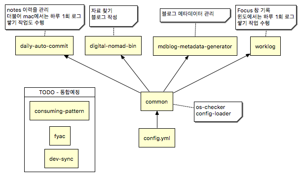

log-me
======

Digital Nomad 를 위한 "기록" 도우미 어플리케이션

## 주요 컴포넌트

 * daily-auto-commit : 매일 자동 노트 커밋 툴
 * digital-nomad-bin : shell script
 * file-tagger : 파일 태깅 / 관리 툴
 * fyac : find-your-associate-contents, 컨텐츠 관리 서버 툴
 * mdblog-metadata-generator : 블로그 메타데이터 작성 툴
 * worklog : 활성 어플리케이션 기록 툴

## 인큐베이터 컴포넌트

 * consuming-pattern : 소비 기록 및 패턴 분석 툴
 * dev-sync : 개발 관련 sync 툴

## 스케쥴러 컴포넌트

대부분의 프로젝트는 필요할때 실행하여 기록을 시작한다. 다만, 웹 활동 기록을 위한 fyac는 서버로써 컴퓨터가 부팅될때 실행되야 하고 분단위/하루 단위 기록이 필요한 worklog와 daily-auto-commit은 crontab이나 task scheduler에 더해져야한다.

스케쥴러 컴포넌트는 해당 작업을 수행하는 컴포넌트다.